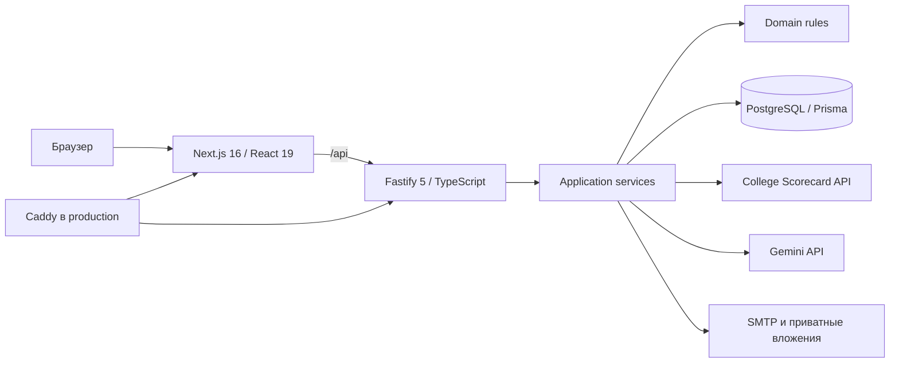

# Admitly

**Admitly** — русскоязычный сервис для абитуриентов, которые выбирают программы бакалавриата в США. Пользователь заполняет профиль, получает объяснимый подбор университетов, сравнивает варианты и переходит к персональному плану поступления с сохранением прогресса.

Решение подготовлено для кейса **«Персональный маршрут поступления»** LOCUS Hackathon 2026, кейс № 2.

> Оценка соответствия показывает совпадение университета с профилем пользователя, а не вероятность поступления. Фактические требования, стоимость и сроки следует проверять по источникам университета.

## Задача и решение

Информация о поступлении обычно разрознена: абитуриенту приходится отдельно сопоставлять направление, оценки, экзамены, бюджет, университеты, требования и сроки. Admitly объединяет эти решения в один маршрут:

1. короткий вход в продукт;
2. анкета с целью обучения, GPA, экзаменами, бюджетом и предпочтениями;
3. диагностика сильных сторон и ограничений профиля;
4. минимум три рекомендации для поддерживаемых направлений;
5. сравнение двух или трёх университетов;
6. персональный roadmap с задачами, зависимостями и сроками;
7. одно выделенное следующее действие и сохранение прогресса.

Целевая аудитория первой версии — абитуриенты бакалавриата, рассматривающие университеты США. Такой фокус позволяет дать связный рабочий сценарий вместо общего каталога для всех стран и уровней образования.

## Возможности

### Профиль и диагностика

Пошаговая анкета собирает направление и год начала обучения, GPA, результаты IELTS, TOEFL или Duolingo, SAT, годовой бюджет, предпочтительные штаты и размер кампуса. На основе этих данных Admitly выделяет сильные стороны профиля, ограничения и задачи, на которых стоит сосредоточиться.

### Подбор университетов

Сервис ранжирует подходящие программы бакалавриата и объясняет результат через академический профиль, совпадение программы, бюджет и личные предпочтения. Для каждого варианта доступны стоимость, основные показатели, направления обучения, источник данных и предупреждения о неизвестных фактах.

### Сравнение

Пользователь может выбрать два или три университета и сопоставить их по оценке соответствия, местоположению, стоимости, направлениям, доле поступивших и доступным требованиям.

### Персональный план

Admitly строит план для трёх наиболее подходящих университетов. В него входят подготовка к экзаменам, документы, проверка требований и заявки. Зависимости между задачами позволяют выделить одно ближайшее действие. Статусы и прогресс сохраняются, а после изменения профиля план пересчитывается с переносом совместимых выполненных задач.

### Письма в приёмную комиссию

Из карточки университета можно открыть редактор письма и получить от Gemini три английских варианта: краткий, сбалансированный и подробный. Дополнительный контекст переводится и встраивается в текст естественным предложением. По умолчанию используется mock-режим без фактической отправки письма.

## Пользовательский сценарий

1. На главной нажать **«Начать подбор»**.
2. Выбрать направление и год начала обучения.
3. Указать GPA, состояние языкового экзамена и SAT.
4. Добавить бюджет и необязательные предпочтения по штату и размеру кампуса.
5. Получить подбор, открыть карточку университета и изучить состав оценки.
6. Добавить два или три варианта в сравнение.
7. Открыть **«План»**, увидеть ближайшее действие и отметить задачу выполненной.
8. Изменить бюджет, направление, экзамен или штат в профиле и нажать **«Пересчитать план»**. Подбор и roadmap обновятся.

## Как работает персонализация

Ранжирование выполняется детерминированно и не зависит от LLM. Максимальные 100 баллов распределены так:

| Компонент | Вес | Что учитывается |
|---|---:|---|
| Академический профиль | 30 | Нормализованный GPA и сопоставление SAT с опубликованной медианой, если она доступна. |
| Совпадение программы | 30 | Наличие программы бакалавриата по выбранному направлению. |
| Бюджет | 25 | Сопоставление годового бюджета с опубликованной стоимостью обучения. |
| Предпочтения | 15 | Штат и размер кампуса. |

Roadmap строится правилами из профиля, выбранных системой университетов и доступных требований. Зависимости задач определяют, какой шаг можно выполнить сейчас. Подтверждённые даты попадают в план только вместе со статусом и ссылкой на источник.

## Архитектура



- **Frontend:** Next.js, React, TypeScript, GSAP, Motion и собственная адаптивная CSS-система.
- **Backend:** Node.js 20+, Fastify, TypeScript, Zod.
- **Хранение:** PostgreSQL 17 и Prisma; вложения писем хранятся отдельно в приватном каталоге.
- **Контракт:** сгенерированный OpenAPI 3.1 находится в [`openapi/openapi.json`](openapi/openapi.json).
- **Развёртывание:** Docker, Docker Compose и Caddy; наружу публикуется только reverse proxy.

### Границы модулей backend

- `src/domain` — профиль, формула рекомендаций, roadmap и правила достоверности;
- `src/application` — пользовательские сценарии и порты внешних зависимостей;
- `src/infrastructure` — PostgreSQL, College Scorecard, Gemini, SMTP и файловое хранилище;
- `src/http` — маршруты, схемы запросов, OpenAPI и обработка ошибок.

## AI, API и источники

### Gemini

Gemini используется только для текста:

- необязательное переформулирование диагностики;
- объяснение уже рассчитанной рекомендации;
- необязательное переформулирование общих задач roadmap;
- генерация трёх вариантов письма в приёмную.

LLM не меняет рейтинг, баллы, сроки, стоимость или зависимости задач. Ответ проходит структурную валидацию и проверки на неподтверждённые утверждения. Основной путь от анкеты до плана работает без Gemini; генерация писем требует `GEMINI_API_KEY`.

### Данные университетов

- [U.S. Department of Education College Scorecard API](https://collegescorecard.ed.gov/data/api/) — университеты, программы, стоимость, размер и доля поступивших в live-режиме.
- `src/infrastructure/demo/fixtures.ts` — вымышленные университеты и требования для воспроизводимого офлайн-демо; все записи имеют статус `demo`.
- Проверенные факты содержат `sourceUrl`, `sourceStatus` и, где применимо, дату проверки. При отсутствии подтверждения интерфейс показывает «Нет данных» или просит проверить требование самостоятельно.

### Готовые компоненты и визуальные материалы

- Готовый UI-kit не используется. Компоненты и стили интерфейса находятся в этом репозитории.
- Анимации реализованы через GSAP и Motion.
- Стартовая визуальная концепция и локальные hero-материалы перенесены из frontend-проекта Atlas и адаптированы под Admitly.
- Декоративные фотографии карточек загружаются с [Unsplash](https://unsplash.com/) и не изображают конкретный университет.
- Локальные шрифты: PT Sans Caption и Lunasima.

## Локальный запуск

### Требования

- Node.js 20 или новее;
- pnpm;
- Docker с Docker Compose.

### 1. Установка и база данных

В корне репозитория:

```powershell
if (-not (Test-Path .env)) { Copy-Item .env.example .env }
pnpm install
npm ci --prefix frontend
docker compose -f compose.dev.yml up -d db
pnpm db:migrate
pnpm db:check
```

Если порт PostgreSQL `5432` занят, укажите `ADMITLY_DEV_DB_PORT` и тот же порт в `DATABASE_URL` файла `.env`.

### 2. Запуск backend

```powershell
pnpm dev
```

API будет доступен на `http://127.0.0.1:3001`.

### 3. Запуск frontend

Во втором терминале:

```powershell
cd frontend
npm run dev
```

Откройте `http://localhost:3000`. Next.js перенаправляет `/api/*` на backend. Для другого адреса задайте `API_ORIGIN`.

## Режимы данных и переменные окружения

По умолчанию `.env.example` включает воспроизводимый режим:

```dotenv
DEMO_DATA_MODE=true
MAIL_DELIVERY_MODE=mock
```

Для реальных данных университетов:

```dotenv
DEMO_DATA_MODE=false
COLLEGE_SCORECARD_API_KEY=your_key
```

Для функций Gemini:

```dotenv
GEMINI_API_KEY=your_key
GEMINI_MODEL=gemini-3.8-flash
GEMINI_LETTER_MODEL=gemini-3.5-flash-lite
```

Mock-режим писем не вызывает SMTP и не отправляет письмо. Для реальной доставки необходимо явно установить `MAIL_DELIVERY_MODE=smtp` и заполнить `SMTP_HOST`, `SMTP_PORT`, `SMTP_SECURE`, `SMTP_USER`, `SMTP_PASSWORD`, `SMTP_FROM_EMAIL` и `SMTP_FROM_NAME`.

## Production

Файл [`deploy/compose.prod.yml`](deploy/compose.prod.yml) поднимает PostgreSQL, API, frontend и Caddy. Пример настроек находится в [`deploy/env.production.example`](deploy/env.production.example).

На Linux-сервере из корня репозитория:

```bash
cp deploy/env.production.example deploy/.env.production
# заполнить секреты и SITE_DOMAIN
bash deploy/scripts/deploy.sh
```

Скрипт проверяет Compose, собирает образы, ожидает PostgreSQL, применяет Prisma migrations и проверяет `/api/health` и `/api/ready`. Секреты и пароли не должны попадать в Git.

## Ограничения

- Первая версия поддерживает программы бакалавриата только в США.
- Оценка соответствия не является прогнозом поступления.
- Для направления «Другое» в демонстрационном наборе пока нет университетов.
- College Scorecard не предоставляет полный набор требований и дедлайнов; неподтверждённые значения остаются неизвестными.
- Фотографии используются для оформления и не относятся к конкретным университетам.
- Реальная отправка писем выключена по умолчанию.
